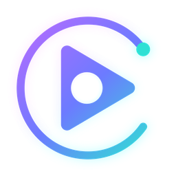
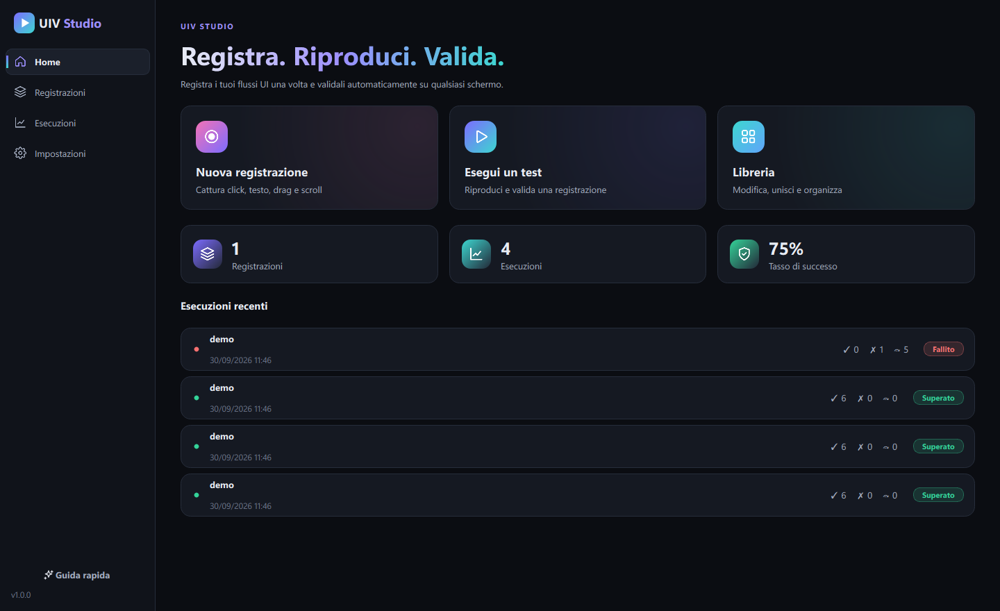
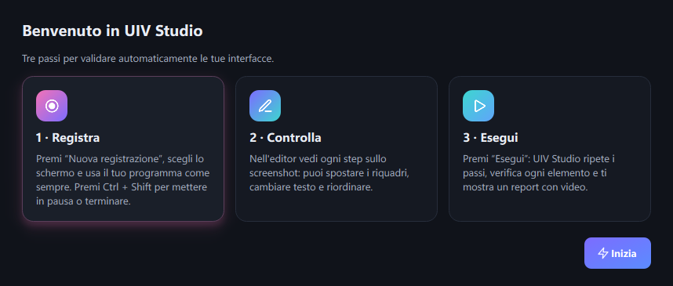
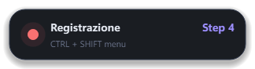
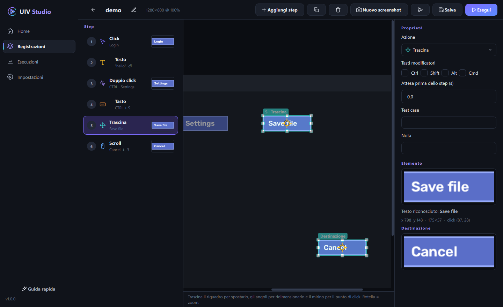
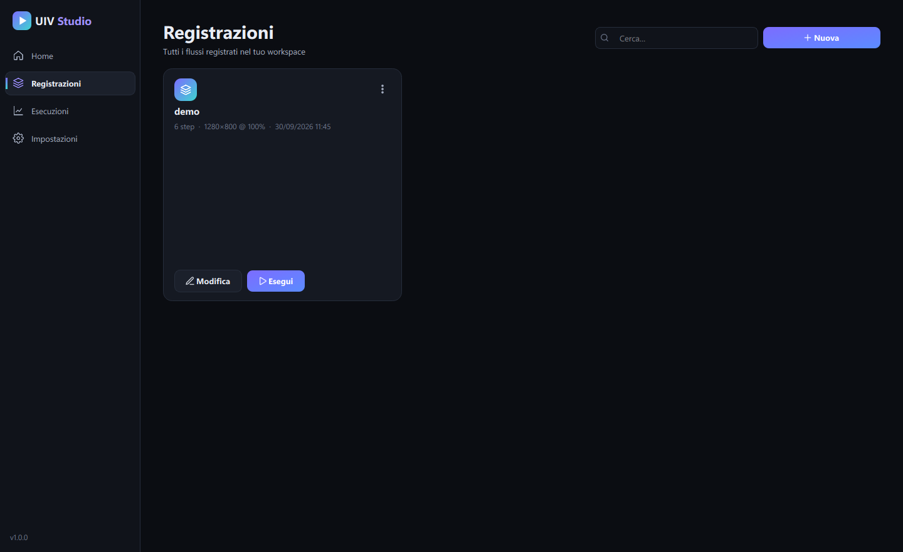
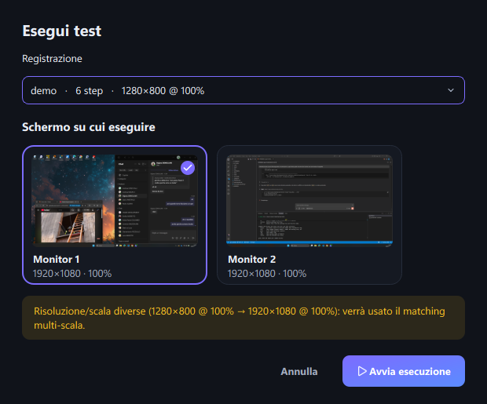
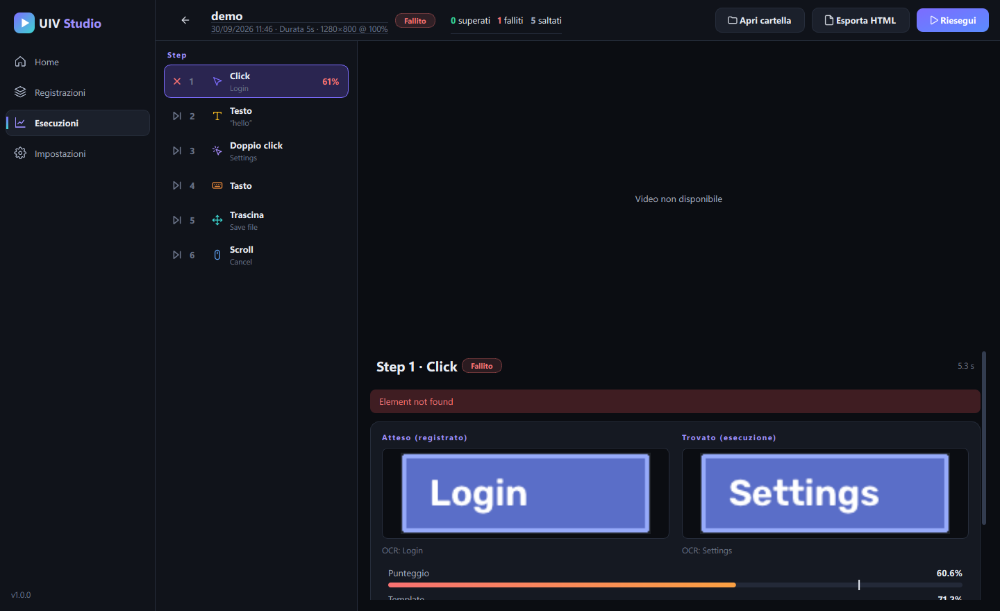
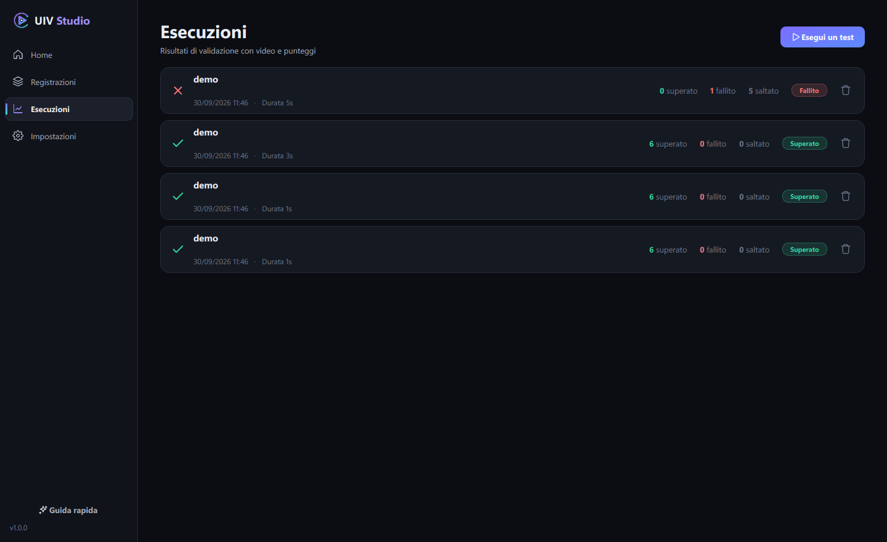
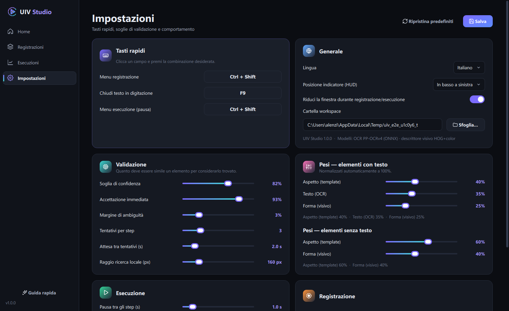

<div align="center">



# UIV Studio

**Registra. Riproduci. Valida.**

Registra un flusso d'interfaccia una volta, poi riproducilo e **validalo automaticamente** su qualsiasi
schermo: prima di ogni azione UIV Studio verifica che l'elemento giusto sia davvero lì, e alla fine ti
consegna un report con punteggi, confronto atteso/trovato e video dell'esecuzione.


-41CD52?logo=qt&logoColor=white)




</div>

---

## Indice

- [Avvio in 10 secondi](#-avvio-in-10-secondi)
- [Come si usa](#-come-si-usa)
- [Impostazioni](#%EF%B8%8F-impostazioni)
- [Come funziona la validazione](#-come-funziona-la-validazione)
- [Modelli](#-modelli-leggeri-solo-cpu)
- [Sviluppo e build](#%EF%B8%8F-sviluppo-e-build)
- [Struttura del progetto](#-struttura-del-progetto)

---

## 🚀 Avvio in 10 secondi

1. Scarica la repo (**Code → Download ZIP**) oppure clonala:
   ```bash
   git clone https://github.com/4Kumiho/uiv-studio.git
   ```
2. Nella cartella avvia l'installer:
   - **Windows:** doppio click su **`Installa UIV Studio.exe`**
   - **Linux:** `sh installa-uiv-studio.sh`
3. L'installer scarica l'ultima versione con una barra di avanzamento e crea **`UIV Studio.exe`**
   (Linux: `UIV Studio`) nella stessa cartella, poi la apre.
4. Da quel momento apri l'app con **`UIV Studio.exe`**. Al suo primo avvio l'app si prepara per ~20 secondi,
   poi parte sempre subito.

Per **aggiornare** basta rilanciare l'installer. Non serve installare Python né altro: serve internet solo
per il download. I file interni dell'app vanno in una cartella nascosta `.uivstudio`.

> [!NOTE]
> **Linux** richiede una sessione **X11/Xorg**. Sotto Wayland il sistema blocca a qualsiasi applicazione
> la cattura globale di mouse, tastiera e schermo (al login scegli “GNOME su Xorg” o equivalente).

Al primo avvio una breve guida spiega i tre passi fondamentali:

<p align="center"></p>

---

## 🧭 Come si usa

### 1 · Registra

**Nuova registrazione** → dai un nome, scegli lo schermo e usa il tuo programma come sempre.
Click, doppio click, click destro, drag & drop, scroll, testo e combinazioni di tasti diventano step.
Un piccolo indicatore mostra lo stato; la hotkey del menu (predefinita **Ctrl + Shift**) apre pausa,
annulla ultimo step, termina o scarta.

<p align="center"></p>

### 2 · Controlla e modifica

Nell'editor vedi ogni step sul suo screenshot. Puoi:

- spostare e ridimensionare il riquadro dell'elemento e il punto di click;
- cambiare azione, tasti modificatori, testo, attese, test case e note;
- riordinare gli step trascinandoli, aggiungerli, duplicarli o eliminarli;
- catturare un nuovo screenshot o unire un'altra registrazione.

<p align="center"></p>

<p align="center"></p>

### 3 · Esegui e leggi il report

**Esegui** → scegli la registrazione e lo schermo. UIV Studio ti avvisa se risoluzione o scala sono
diverse da quelle registrate (vengono gestite automaticamente).

<p align="center"></p>

Durante l'esecuzione la hotkey mette in pausa (riprendi, salta step, interrompi). Alla fine il report
mostra per ogni step l'esito, l'elemento **atteso** accanto a quello **trovato**, i punteggi rispetto alla
soglia e il video sincronizzato (clic sui marker della timeline per saltare allo step). Il report si
esporta in HTML.

<p align="center"></p>

<p align="center"></p>

---

## ⚙️ Impostazioni

Tutto si regola dall'interfaccia, senza toccare file:

| Sezione | Cosa puoi cambiare |
|---|---|
| **Tasti rapidi** | menu registrazione, chiusura testo, menu esecuzione (clicca e premi la combinazione; i conflitti vengono segnalati) |
| **Validazione** | soglia di confidenza, accettazione immediata, margine di ambiguità, tentativi per step, attesa tra tentativi, raggio di ricerca |
| **Pesi** | peso di aspetto, testo e forma, separati per elementi con e senza testo |
| **Esecuzione** | pausa tra gli step, velocità mouse e digitazione, video e FPS, stop al primo errore |
| **Registrazione** | intervallo doppio click, soglia drag, raggruppamento scroll |
| **Generale** | lingua (IT/EN), posizione dell'indicatore, riduzione finestra, cartella workspace |

<p align="center"></p>

---

## 🎯 Come funziona la validazione

Per ogni step, a ogni tentativo UIV Studio fa uno screenshot nuovo e:

1. **Ricerca locale** attorno alla posizione registrata. Se il punteggio supera *Accettazione immediata*,
   l'elemento è trovato.
2. **Ricerca globale** multi-scala su tutto lo schermo e, se l'elemento contiene testo, **ricerca per testo**.
3. Ogni candidato riceve un **punteggio composito** pesato:
   - **aspetto**: correlazione dei colori con il ritaglio registrato;
   - **testo**: somiglianza del testo letto con l'OCR;
   - **forma**: descrittore visivo.

   Se due candidati sono quasi pari vince il più vicino alla posizione registrata, così pulsanti identici
   altrove non vengono scambiati.
4. Sopra la **soglia di confidenza** lo step passa e l'azione viene eseguita nel punto corrispondente;
   altrimenti si riprova fino al numero di tentativi impostato.

Nei test automatici l'elemento viene ritrovato con schermo identico, elementi spostati e risoluzione
diversa con scala 125%; un elemento assente viene correttamente segnalato come **Fallito**
(punteggio 0.61 con soglia 0.82: nessun falso positivo).

---

## 🧠 Modelli leggeri, solo CPU

Nessun PyTorch e nessuna GPU richiesta.

| Segnale | Implementazione | Dimensione |
|---|---|---|
| Testo | OCR PP-OCRv4 (rilevamento + riconoscimento) su ONNX Runtime | ~15 MB |
| Aspetto | OpenCV `TM_CCOEFF_NORMED` multi-scala | — |
| Forma | descrittore gradienti + istogramma colore; opzionale MobileNetV3-Small ONNX ([`tools/export_embedder.py`](tools/export_embedder.py)) | 0 / ~6 MB |

---

## 🛠️ Sviluppo e build

```bash
python -m venv .venv
.venv\Scripts\pip install -r requirements.txt      # Linux: .venv/bin/pip
python -m uiv_studio                               # avvia l'app
python tests/test_engine_e2e.py                    # test end-to-end del motore (non muove il mouse)
```

**Rilascio di una nuova versione:** aggiorna `__version__` in `uiv_studio/__init__.py`, poi
`git tag v1.0.1 && git push --tags`. GitHub Actions compila gli eseguibili Windows e Linux e li allega alla
Release; gli installer scaricano sempre l'ultima.

**Eseguibile Windows in locale** (unico file, creato nella root del progetto):

```powershell
powershell -ExecutionPolicy Bypass -File packaging\build_windows.ps1
```

**Eseguibile Linux** (unico file, compilato su glibc 2.31 per girare su Ubuntu 20.04+, Debian 11+,
Fedora, RHEL/Rocky 9, openSUSE, Arch, Mint…):

```bash
docker build -t uiv-build -f packaging/Dockerfile.linux .
docker run --rm -v "$PWD":/src uiv-build
```

L'eseguibile è un piccolo launcher con l'app compressa in coda ([`launcher/launcher.py`](launcher/launcher.py)):
al primo avvio la estrae con una barra di avanzamento, poi la avvia.

Dati utente:

- workspace (registrazioni `.uivr` ed esecuzioni `.uivx` + video): `Documenti/UIV Studio`
- impostazioni e log: `%APPDATA%\UIV Studio` · `~/.config/uiv-studio`

---

## 📁 Struttura del progetto

```
uiv_studio/
  core/      impostazioni, tasti, monitor e DPI, modelli dati, archivio SQLite
  vision/    riquadro elemento, OCR, descrittore visivo, matcher
  engine/    cattura input, registratore, esecutore, azioni, video
  ui/        tema, widget animati, indicatore e menu di sessione, pagine
installer/   installer leggero della root: scarica l'eseguibile dalla Release
launcher/    eseguibile unico: estrae l'app al primo avvio e la avvia
packaging/   spec PyInstaller, script di build Windows/Linux, Dockerfile
tests/       test end-to-end del motore
docs/        screenshot
```
